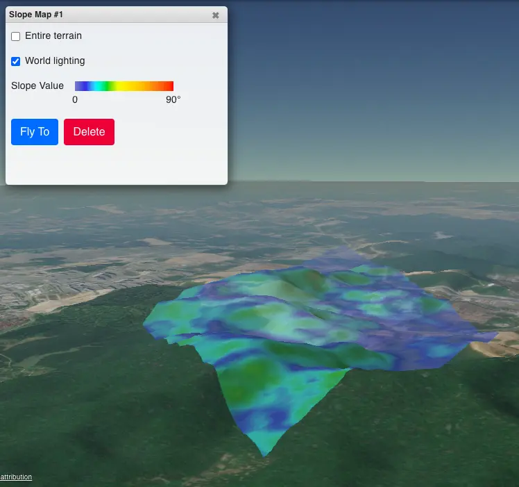

# 3D Map

3D Map for [TuxGeo+](https://www.tuxuri.com/products/tuxgeo-for-enterprise/).

This repository contains some of CesiumJS custom components for TuxGeo+ 3D Map.

- TerrainRGBImageryProvider

  Support TerrainRGB as ImageryProvider for CesiumJS. [Terrain-RGB](https://docs.mapbox.com/data/tilesets/guides/access-elevation-data/) is image format that contains global elevation data encoded in raster PNG tiles as color values that can be decoded to raw heights in meters.
  Cesium can style terrain contour/slope for a globe as example sandcastle [Global Materials](https://sandcastle.cesium.com/?src=Globe%20Materials.html), but don't support style for selected area. This TerrainRGBImageryProvider can help you to style terrain for selected area.

Source code extends [Cesium ion SDK](https://cesium.com/platform/cesiumjs/ion-sdk/). Original Cesium ion SDK is not included in this repository. Please contact [Cesium](https://cesium.com/contact/) for more information.
